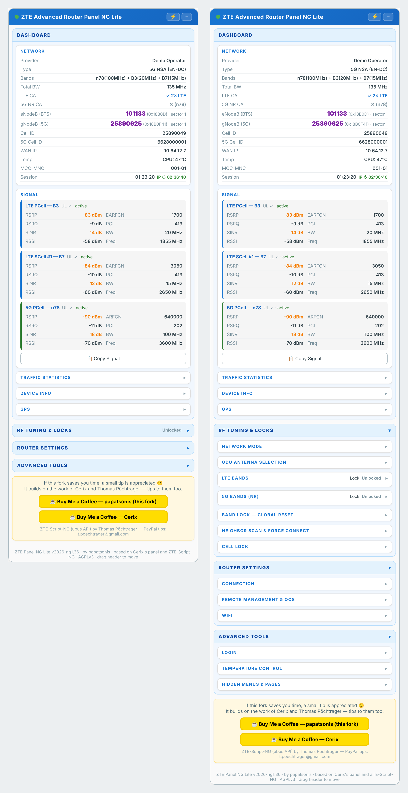

# ZTE Advanced Router Panel NG

A floating control panel for **newer ZTE 4G/5G routers** — the ones whose web interface talks to the router through the ubus JSON-RPC API (ZTE MC7520, MC7523/G5TC, MC7530 and later). It is a userscript: it runs inside the router's own web page and adds signal details, band and cell locking, a neighbor scan, bridge mode, DNS, traffic statistics and more.

This is a port of [ZTE Advanced Router Panel](https://github.com/Cerix/zte-advanced-router-panel) by **Cerix** to the newer router API, built on the API calls of [ZTE-Script-NG](https://github.com/tpoechtrager/ZTE-Web-Script) by **Thomas Pöchtrager**. See [Credits](#credits).

> **Older routers (MC888, MC889, MC7010 …)** use a different API. For those, use [Cerix's original panel](https://github.com/Cerix/zte-advanced-router-panel) or the [legacy ZTE-Script](https://github.com/tpoechtrager/ZTE-Web-Script).



*The Lite edition, shown with demo data.*

## Two editions

| Edition | For | Install |
|---|---|---|
| **Lite** | Everyday use. All the controls, none of the developer tools. | [zte-advanced-panel-ng-lite.user.js](https://raw.githubusercontent.com/papatsonis/zte-advanced-router-panel-ng/main/zte-advanced-panel-ng-lite.user.js) |
| **Full** | Everything in Lite, plus tools for exploring the router's API. | [zte-advanced-panel-ng.user.js](https://raw.githubusercontent.com/papatsonis/zte-advanced-router-panel-ng/main/zte-advanced-panel-ng.user.js) |

Install one of them. If you install both, keep only one enabled at a time.

## Install

1. Install a userscript manager in your browser: [Tampermonkey](https://www.tampermonkey.net/) or [Violentmonkey](https://violentmonkey.github.io/).
2. Click one of the install links in the table above and confirm the installation.
3. Open your router's web page and log in. The panel appears in the top-left corner a moment after the page has loaded.

The script runs on `192.168.0.1`, `192.168.1.1`, `192.168.8.1` and `192.168.254.1`. If your router uses another address, add a matching `@match` line at the top of the script.

## Features

| Section | What it does |
|---|---|
| **Network** | Provider, network type, active bands, total bandwidth, LTE and 5G carrier aggregation, eNodeB / gNodeB, cell IDs, WAN IP, temperature, session time with a countdown to the next IP renewal |
| **LTE / 5G signal** | One card per carrier: RSRP, RSRQ, SINR, RSSI, (E)ARFCN, PCI, bandwidth, frequency |
| **ODU antenna selection** | Automatic, directional (front), directional wide beam (rear) or omnidirectional. The options and their names are read from the router's own Developer options page. Shown only on models that have this setting |
| **Neighbor scan & force connect** | Runs the router's built-in neighbor scan and lets you lock to any cell it finds |
| **Connection** | Reconnect mobile data, DNS (manual or operator), bridge mode on/off, ARP proxy on/off, reboot |
| **Network mode** | 5G SA, 5G NSA, 4G/5G auto, LTE only |
| **LTE bands / 5G bands** | One-click band locks with live status. Each frame lists the bands your router supports (read from the router); a button that needs a band it does not have is left out, and such a band is refused in "Custom". A 5G lock is written to both the SA and the NSA list and read back to confirm it was saved |
| **Cell lock** | Lock or unlock an LTE cell (PCI + EARFCN) or a 5G cell (PCI + ARFCN + band); reset all locks |
| **Traffic statistics** | Live speeds, session, monthly and all-time totals; reset the monthly counters; set the automatic reset day |
| **Device info** | CPU temperature and load, memory, uptime, WAN details, SIM info, hardware/software versions, SMS storage, APN (view and switch profile) |
| **GPS** | Whether the router has GPS, and its position with a map link. Says "not available on this router" when it has none |
| **WiFi** | Radio info, transmit power, country. Hidden on routers without WiFi (outdoor units such as the MC7530) |
| **Hidden settings** | Session timeout (how long until the router logs you out) and temperature control. Each is shown only if the router supports it |
| **Login & tools** | Optional auto login, developer login, copy a signal report, hidden menus and hidden pages of the router's own web interface |

**Full edition only:** API finder (searches the router's own web code for a keyword), call recorder (logs the calls the router's pages make), custom ubus call, raw netinfo dump, raw scan data, 5G NSA lock probe.

## Compatibility

Tested on a **ZTE MC7530**; the sections that depend on the model (ODU antenna, GPS, WiFi, hidden settings) were also checked on an **MC8532B**. GPS, antenna selection and the band lists were also checked on a **G5TC** (B07 firmware). The basic calls come from ZTE-Script-NG, which was written for the G5TC and later models; the rest were taken from the MC7530's own web interface. Other ubus-based ZTE routers may work fully or only partly — firmware differs between models and operators.

## Things to know before you click

- **Everything stays local.** The script only talks to your router. The only outside links are the ones you click yourself (the map link and the tip links).
- **You log in on the router's own page.** The panel starts once you are in and pauses whenever you are logged out.
- **Auto login is optional and off by default.** If you turn it on (🔑 Auto Login), a SHA-256 hash of the router password is kept in the browser's storage for the router's address. Anyone who can use that browser profile can then open the router page, and the hash itself is enough to log in — so do not turn it on on a shared computer. "Forget Password" removes it.
- **Band and cell locks stay in place** until you remove them. "Remove band lock" works by locking to all bands of your router. The panel reads that list from the router; only if the router reports none does it use the lists in the `CFG` block.
- **Locking to a cell of another operator** leaves the router without service until you unlock it. A cell lock takes effect after you switch network mode or reboot.
- **Bridge mode** turns the router's routing off: the device on the LAN port gets the mobile IP directly, and Wi-Fi clients may lose internet. Try it from a computer connected by cable.
- **ARP proxy** is a hidden setting of the firmware. The router accepts the switch only in a developer session, so the panel asks for the router password if none is saved. The panel shows the stored setting; if nothing changes on your network after switching, reboot the router.
- **Hidden Menus** shows menu entries and page parts that the router's own web interface hides (marked with a dashed outline), and **Hidden pages** lists pages it has but does not link. Both only change what the page displays. Some of these belong to features your model does not have, so a page may be empty or its settings may do nothing.
- **The neighbor scan disconnects mobile data** while it runs (about 30 seconds). The panel turns it back on afterwards.
- **ODU antenna selection** is meant for debugging, according to ZTE: keep *Automatic switching* in normal use. A change may ask for the router password (developer session) and lasts until the next reboot.
- **Temperature control** is the firmware's protection against overheating; keep it on. If you turn it off, the router turns it back on after a restart.
- **Session timeout** accepts 60–86400 seconds. Setting it is not offered by the router's own web interface; the panel uses the firmware's own call for it.
- **Sections depend on the model.** The ODU antenna, WiFi and hidden-settings sections appear only when the router answers their calls, and GPS says "not available" on routers without it.

This project is not affiliated with ZTE. Use it at your own risk.

## Auto login

With a saved password, the panel logs in for you when you open the router page and nobody is logged in. It logs in once and then reloads the page once, so that the router's own page starts up already logged in — you see a short flash of the login form first.

- It is skipped right after you press **Logout**, so logging out works. Reload the page a few seconds later to log in again.
- It never logs in while you are using the router page. If the session ends, the panel pauses and waits for you.
- If the router rejects the saved password, the panel removes it and tells you.

## Configuration

A small `CFG` block at the top of the script holds the settings most people might change:

```js
var CFG = {
  bmac: true,              // false hides the tip box
  pollInterval: 1000,      // ms between signal refreshes
  ip_cycle_hours: 4,       // countdown to the operator's IP renewal; 0 hides it
  lte_all_bands: [...],    // used only if the router does not report its own LTE bands
  nr_all_bands: [...],     // used only if the router does not report its own 5G bands
};
```

## Development

The Lite edition is generated from the full one. Edit only `zte-advanced-panel-ng.user.js`, then run:

```sh
python3 tools/build_lite.py
```

The build stops with an error if the full script has changed in a way it does not expect, rather than producing a broken Lite edition.

## Credits

This panel exists because of other people's work:

- **[Cerix](https://github.com/Cerix/zte-advanced-router-panel)** — *ZTE Advanced Router Panel* (MIT). The panel's design, layout and feature set come from it. Tips: [buymeacoffee.com/cerix](https://buymeacoffee.com/cerix)
- **[Thomas Pöchtrager](https://github.com/tpoechtrager/ZTE-Web-Script)** — *ZTE-Script-NG* (AGPLv3+). The ubus calls, login flow, signal parsing and frequency tables come from it. Tips: PayPal `t.poechtrager@gmail.com`
- **[open-u60-pro](https://github.com/jesther-ai/open-u60-pro)** by Jesther Silvestre and **[zte-u60-pro-mu5250-manager](https://github.com/faying/zte-u60-pro-mu5250-manager)** by faying (both MIT) — their research on the ZTE U60 Pro showed which ubus calls exist for the neighbor scan, mobile data on/off, DNS, APN, ARP proxy and resetting locks. Only the call and parameter names were used; no code from them is included.

This version is a separate, modified work. It is not maintained or endorsed by the original authors, so please report problems [here](https://github.com/papatsonis/zte-advanced-router-panel-ng/issues) and not to them.

## License

[GNU Affero General Public License v3.0 or later](LICENSE). Notices for the works this one is based on are in [THIRD-PARTY-NOTICES.md](THIRD-PARTY-NOTICES.md).
